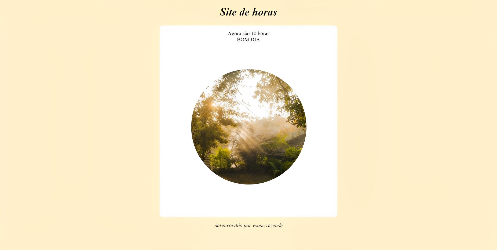
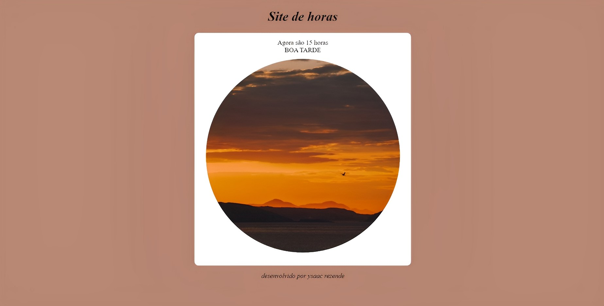
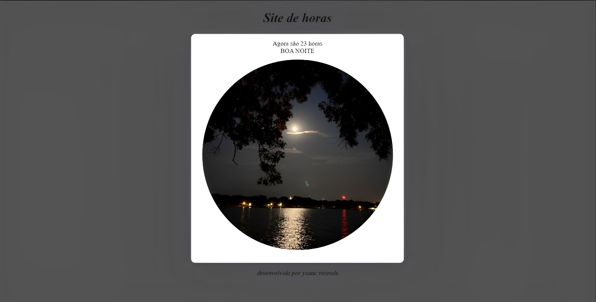

# Site_de_horas
Site que carrega uma imagem e um layout diferente conforme o horário do dia.
É um site simples que carrega uma imagem e um layout diferente dependendo do horário do dia. O objetivo é proporcionar uma experiência mais agradável para o usuário, com um visual que combine com o momento do dia.
O site utiliza JavaScript para verificar o horário atual e carregar a imagem e o layout correspondentes. A imagem de fundo é alterada de acordo com o período do dia (manhã, tarde ou noite) e a paleta de cores e estilo da página também são adaptados.
Para utilizar o site, basta acessar a página e aguardar a verificação do horário. Em seguida, a imagem e o layout serão atualizados automaticamente.

Link para visualização: https://ysrezende40.github.io/Site_de_horas/
-----------------------------------------------------------------------
**Exemplo para o período da manhã**

------------------------------------------------------------------------
**Exemplo para o período da tarde**

-----------------------------------------------------------------------
**Exemplo para o período da noite**

